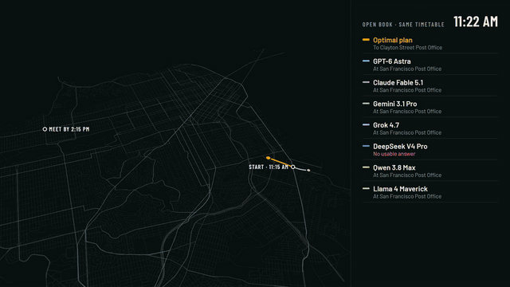

# LLMuni



**Can LLMs ride Muni?** LLMuni is a benchmark where language models plan real San Francisco errand days on Muni,
BART and foot: pick up a book before the bookstore closes, mail a parcel, find a bike shop, then meet a friend
across town by 2:15. Every plan is matched to real stores, replayed minute by minute on the real timetable with
real opening hours, and compared against a provably optimal plan from an exact solver.

<!-- headline:start -->
- **Open book:** GPT-6 Astra leads: 96% of its plans work on the timetable, a median +1.8% slower than the provably optimal plan.
- **Closed book:** 0 of 7 models produced any plan that works when they had to name real stores themselves; the best model's impossible-plan rate was 41%.
- **v2026.10**, final run: 30 tasks x 7 models x 2 modes, $27.14 of model calls in total.
<!-- headline:end -->

Video: [`video/out/llmuni_16x9.mp4`](video/out/llmuni_16x9.mp4) · [`video/out/llmuni_4x5.mp4`](video/out/llmuni_4x5.mp4) ·
Site: `site/` (leaderboard and 3D route replay; `cd site && npm install && npm run dev`)

## Leaderboard

<!-- leaderboard:start -->
**Open book (candidate stores listed)**

| # | Model | Feasible | Vs optimal (median) | Impossible plans | No such store | Wrong address | Spots impossible | $ / task |
|---:|---|---:|---:|---:|---:|---:|---:|---:|
| 1 | GPT-6 Astra | 96% | +1.8% | 4% | 0% | 0% | 100% | $0.069 |
| 2 | Grok 4.7 | 96% | +7.0% | 0% | 0% | 0% | 100% | $0.083 |
| 3 | Gemini 3.1 Pro | 93% | +8.3% | 7% | 0% | 0% | 100% | $0.041 |
| 4 | Claude Fable 5.1 | 85% | +2.2% | 15% | 0% | 0% | 100% | $0.095 |
| 5 | Qwen 3.8 Max Prime | 78% | +13.2% | 22% | 0% | 0% | 100% | $0.121 |
|  | Greedy baseline | 70% | +8.5% | 22% | 0% | 0% | 67% | — |
| 6 | DeepSeek V4 Pro | 59% | +11.3% | 15% | 0% | 0% | 100% | $0.034 |
| 7 | Llama 4 Maverick | 56% | +26.4% | 44% | 0% | 0% | 0% | $0.001 |
|  | Random baseline | 37% | +86.0% | 63% | 0% | 0% | 0% | — |

**Closed book (the model names real stores)**

| # | Model | Feasible | Vs optimal (median) | Impossible plans | No such store | Wrong address | Spots impossible | $ / task |
|---:|---|---:|---:|---:|---:|---:|---:|---:|
| 1 | Grok 4.7 | 0% | — | 41% | 38% | 44% | 100% | $0.100 |
| 2 | Claude Fable 5.1 | 0% | — | 67% | 4% | 67% | 100% | $0.113 |
| 3 | DeepSeek V4 Pro | 0% | — | 67% | 14% | 82% | 100% | $0.020 |
| 4 | GPT-6 Astra | 0% | — | 70% | 11% | 63% | 100% | $0.087 |
| 5 | Qwen 3.8 Max Prime | 0% | — | 89% | 4% | 96% | 100% | $0.106 |
| 6 | Gemini 3.1 Pro | 0% | — | 93% | 18% | 82% | 100% | $0.035 |
| 7 | Llama 4 Maverick | 0% | — | 96% | 69% | 93% | 33% | $0.001 |

30 tasks (10 easy, 10 medium, 10 hard); each model answered each task once. Feasible: the plan replays on the timetable with every store open and every time met. Vs optimal: extra time over the provably optimal plan among feasible plans. Definitions: [docs/methods.md](docs/methods.md).
<!-- leaderboard:end -->

**Open book** lists six candidate stores per errand with addresses, opening hours and coordinates; the model
still has to work out travel times. **Closed book** gives only the errands, so the model must know real stores.
In closed book a plan counts as feasible only if every store it names is found and verified open, so plans also
fail on stores that OpenStreetMap lacks or whose hours are unknown; the site's "How plans fail" chart shows
those separately from plans that are impossible.

## How it works

1. **Data.** Muni and BART GTFS timetables for one week (Oct 5-11, 2026), San Francisco stores from an
   OpenStreetMap extract with parseable opening hours, and the city's business registry (used only to tell a real
   store OSM lacks from an invented one). Versions are pinned in [`data/MANIFEST.json`](data/MANIFEST.json).
2. **Router.** [R5](https://github.com/conveyal/r5) door-to-door times on foot, bus, rail and BART on a
   five-minute departure grid; the arrival function is FIFO, so waiting never helps.
3. **Tasks.** 300 seeded errand days in three tiers ([`benchmark/v2026.10/`](benchmark/v2026.10)), 10% impossible
   by design (a store type closed that day, a deadline no plan can meet).
4. **Oracle.** An exact label-setting search over (errands done, place) finds the fastest plan; brute force and a
   MILP agree with it on every checked instance.
5. **Grader.** Answers are strict JSON. Each stop is matched to a store (id, address, offline geocoding, name),
   then the plan is replayed with the oracle's own simulator: closed stores, missed deadlines and late arrivals
   are caught exactly.

Full method: [docs/methods.md](docs/methods.md). Budget and run log: [docs/plan.md](docs/plan.md).

## Reproduce

```sh
make setup                 # Python environment (uv)
make data tasks oracle     # data, R5 matrices (~2 h once), 300 tasks and their optimal plans
make estimate              # cost of what remains, and how many rounds fit the budget
make finish BUDGET_USD=29  # final eval (cached answers are never re-paid), results, site, video, README
```

[FINISH.md](FINISH.md) documents `make finish`, the budget rules and the optional tool-mode step (v2).
Every paid answer is committed under `results/answers/`, so the leaderboard can be regraded for free.

## Limitations

- Scheduled GTFS, not real-time: no delays are modeled.
- OSM opening hours can be incomplete or outdated; tasks only use stores with parseable hours.
- Walking speed (1.3 m/s) and time spent at each store are assumptions (`config.yaml`).
- Each model answers each task once, at default temperature, with medium reasoning effort.
- 30 of the 300 tasks were run in this release (10 per tier), a budget decision; the rest run with more budget.
- Closed-book feasibility is bounded by what OpenStreetMap and the business registry can verify; a real store
  registered under a different legal name can be counted as nonexistent.

## Repository

`src/llmuni/` (pipeline: data, router, tasks, oracle, grader, eval, site export) · `tests/` · `benchmark/` ·
`results/` · `site/` (Vite + deck.gl + MapLibre) · `video/` (Remotion) · `reports/` (checkpoint reports).

Independent research, not affiliated with SFMTA, Muni or BART. Map data © OpenStreetMap contributors.
