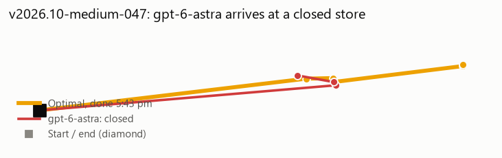
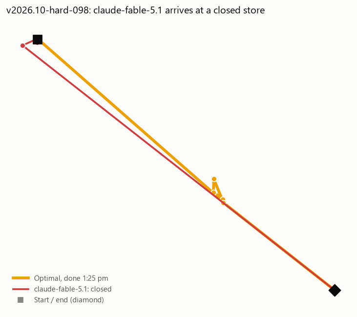
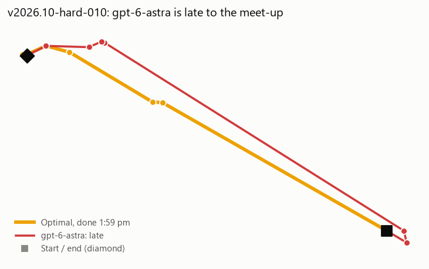
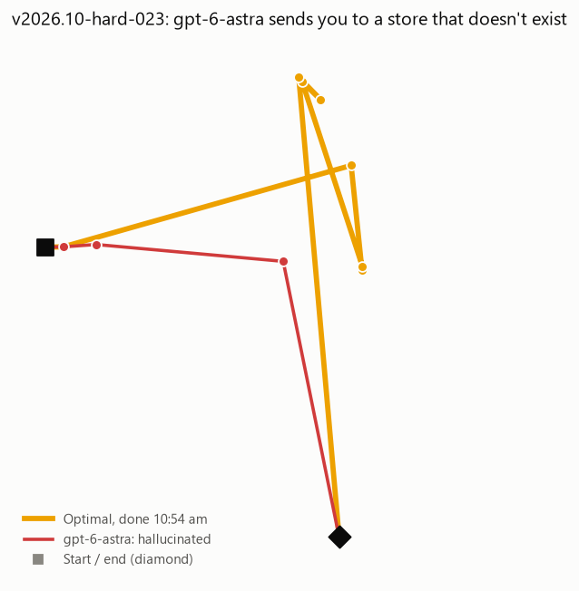
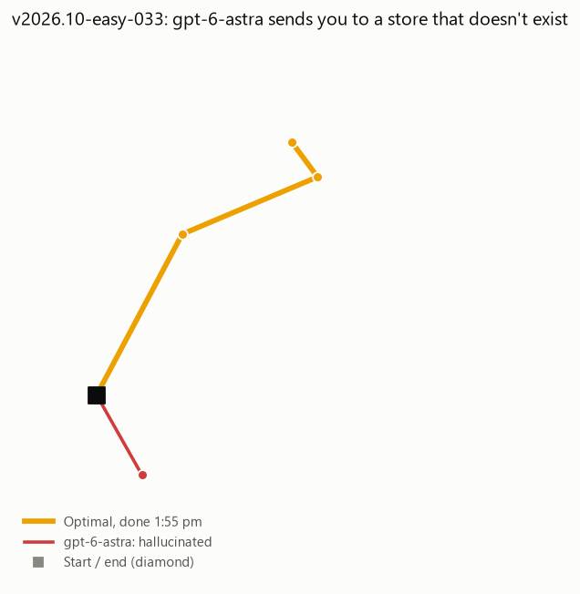

# Checkpoint 3: hero-task candidates

A well-known frontier model fails visibly on a feasible task; the optimal plan (gold) is clearly better.

## 1. gpt-6-astra arrives at a closed store (closed book, v2026.10-medium-047)

> It's Tuesday, October 6, and I'm heading out from 45th Ave & Judah (Sunset) around 4:10 pm. No car today: just Muni, BART and walking. Today I need to buy pastries at a bakery (about 5 minutes), buy flowers at a florist (about 10 minutes), buy picture hooks at a hardware store (about 10 minutes), grab a coffee at a café (about 10 minutes), and pick up groceries at a supermarket (about 20 minutes). Tell me exactly which stores to visit and in what order so I finish as early as I can. If it can't all be done, tell me it's impossible and why.

**gpt-6-astra** (infeasible: closed: errand 2 cannot be served after arriving at 991)

| # | Errand | Store | Arrive | Done |
|---|---|---|---|---|
| 1 | Coffee | Snowbird Coffee | 4:31 pm | — **← closed** |
| 2 | Florist | Sunset Floral | — | — **← not a real store** |
| 3 | Bakery | Arizmendi Bakery | — | — |
| 4 | Hardware | Progress Hardware | — | — **← not a real store** |
| 5 | Supermarket | Andronico's Community Markets | — | — |

**Optimal** (done 5:43 pm):

| # | Errand | Store | Arrive | Done |
|---|---|---|---|---|
| 1 | Florist | French Florist | 4:31 pm | 4:41 pm |
| 2 | Coffee | Beanery | 4:45 pm | 4:55 pm |
| 3 | Bakery | Arizmendi Bakery | 4:55 pm | 5:00 pm |
| 4 | Supermarket | Luke's Local | 5:13 pm | 5:33 pm |
| 5 | Hardware | Cole Hardware | 5:33 pm | 5:43 pm |

## 2. claude-fable-5.1 arrives at a closed store (closed book, v2026.10-hard-098)

> It's Tuesday, October 6, and I'm heading out from 6th Ave & Clement (Richmond) around 11:00 am. I don't have a car, so I'll get around on Muni, BART and on foot. Today I need to get cash from a bank or ATM (about 5 minutes), drop off library books at a library (about 10 minutes), get a bouquet from a florist (about 10 minutes), get my bike light fixed at a bike shop (about 20 minutes), pick up a book I ordered at a bookstore (about 15 minutes), and pick up a loaf of bread at a bakery (about 5 minutes). I have to get a bouquet from a florist by 12:00 pm at the latest. I have to pick up a loaf of bread at a bakery by 11:35 am at the latest. When I'm done I'm meeting a friend at 3rd & Palou (Bayview) and need to be there by 1:45 pm. Which specific stores should I go to, and in what order, so I'm done as early as possible? If it can't all be done, tell me it's impossible and why.

**claude-fable-5.1** (infeasible: closed: errand 0 cannot be served after arriving at 660)

| # | Errand | Store | Arrive | Done |
|---|---|---|---|---|
| 1 | Bakery | Schubert's Bakery | 11:00 am | — **← closed** |
| 2 | Bank / ATM | Bank of America (ATM) | — | — |
| 3 | Bookstore | Green Apple Books | — | — |
| 4 | Florist | Clement Florist | — | — **← not a real store** |
| 5 | Library | Richmond Branch Library (SFPL) | — | — |
| 6 | Bike shop | Huckleberry Bicycles | — | — **← not a real store** |

**Optimal** (done 1:25 pm):

| # | Errand | Store | Arrive | Done |
|---|---|---|---|---|
| 1 | Bakery | Harvest Wheat Field Bakery | 11:00 am | 11:05 am |
| 2 | Florist | La Poblanita | 11:43 am | 11:53 am |
| 3 | Bike shop | Valencia Cyclery | 12:01 pm | 12:21 pm |
| 4 | Library | Mission Temporary Branch, San Francisco Public Library | 12:25 pm | 12:35 pm |
| 5 | Bank / ATM | BMO | 12:39 pm | 12:44 pm |
| 6 | Bookstore | Libreria Palabra de Dios | 12:45 pm | 1:00 pm |

## 3. gpt-6-astra is late to the meet-up (open book, v2026.10-hard-010)

> It's Thursday, October 8, and I'm heading out from 3rd & Evans (Bayview) around 11:15 am. No car today: just Muni, BART and walking. Today I need to pick up a book I ordered at a bookstore (about 15 minutes), drop off a parcel at a post office (about 15 minutes), buy a new inner tube at a bike shop (about 20 minutes), get cash from a bank or ATM (about 5 minutes), buy pastries at a bakery (about 5 minutes), and return books at a library (about 10 minutes). I have to pick up a book I ordered at a bookstore by 2:10 pm at the latest. I have to buy pastries at a bakery by 1:15 pm at the latest. When I'm done I'm meeting a friend at 25th Ave & Geary (Richmond) and need to be there by 2:15 pm. Tell me exactly which stores to visit and in what order so I finish as early as I can. If it can't all be done, tell me it's impossible and why.

**gpt-6-astra** (infeasible: late: cannot reach the end in time)

| # | Errand | Store | Arrive | Done |
|---|---|---|---|---|
| 1 | Post office | San Francisco Post Office | 11:22 am | 11:37 am |
| 2 | Bank / ATM | F3 Credit Union | 11:43 am | 11:48 am |
| 3 | Bakery | Harvest Wheat Field Bakery | 12:57 pm | 1:02 pm |
| 4 | Bookstore | Green Apple Books | 1:03 pm | 1:18 pm |
| 5 | Library | Richmond Branch - San Francisco Public Library | 1:23 pm | 1:33 pm |
| 6 | Bike shop | Spoke Easy SF | 1:48 pm | 2:08 pm |

**Optimal** (done 1:59 pm):

| # | Errand | Store | Arrive | Done |
|---|---|---|---|---|
| 1 | Post office | Clayton Street Post Office | 12:03 pm | 12:18 pm |
| 2 | Library | Park Branch Library | 12:22 pm | 12:32 pm |
| 3 | Bakery | House of Bagels | 12:56 pm | 1:01 pm |
| 4 | Bike shop | Spoke Easy SF | 1:10 pm | 1:30 pm |
| 5 | Bank / ATM | Citibank | 1:37 pm | 1:42 pm |
| 6 | Bookstore | Holy Virgin Cathedral Bookstore | 1:43 pm | 1:58 pm |

## 4. gpt-6-astra sends you to a store that doesn't exist (closed book, v2026.10-hard-023)

> Plan my Saturday (October 10) for me. I'll leave Dolores Park (18th & Dolores) (Mission) at 8:10 am. No car today: just Muni, BART and walking. Today I need to grab a coffee at a café (about 10 minutes), drop off library books at a library (about 10 minutes), pick up a loaf of bread at a bakery (about 5 minutes), grab my prescription from a pharmacy (about 10 minutes), buy a new inner tube at a bike shop (about 20 minutes), pick up my dry cleaning (about 5 minutes), and withdraw cash at a bank or ATM (about 5 minutes). I have to grab a coffee at a café by 9:35 am at the latest. I have to drop off library books at a library by 10:40 am at the latest. When I'm done I'm meeting a friend at 3rd & Palou (Bayview) and need to be there by 11:20 am. Tell me exactly which stores to visit and in what order so I finish as early as I can. If it can't all be done, tell me it's impossible and why.

**gpt-6-astra** (hallucinated: no dry_cleaning called 'Dolores Cleaners' at that address)

| # | Errand | Store | Arrive | Done |
|---|---|---|---|---|
| 1 | Bakery | Tartine Bakery | 8:12 am | 8:17 am |
| 2 | Dry cleaning | Dolores Cleaners | — | — **← not a real store** |
| 3 | Coffee | Linea Caffe | — | — |
| 4 | Bank / ATM | Chase Bank ATM | — | — **← not a real store** |
| 5 | Bike shop | Sports Basement Bryant Street — Bike Department | — | — **← not a real store** |
| 6 | Pharmacy | Walgreens Pharmacy | — | — **← not a real store** |
| 7 | Library | Potrero Branch Library | — | — |

**Optimal** (done 10:54 am):

| # | Errand | Store | Arrive | Done |
|---|---|---|---|---|
| 1 | Bakery | Tartine Bakery | 8:12 am | 8:17 am |
| 2 | Bank / ATM | Golden 1 Credit Union ATM | 8:43 am | 8:48 am |
| 3 | Bike shop | Velocipede Cyclery | 9:02 am | 9:22 am |
| 4 | Coffee | Paper Son Coffee - Dogpatch | 9:22 am | 9:32 am |
| 5 | Pharmacy | Walgreens | 9:49 am | 9:59 am |
| 6 | Library | Mission Bay Branch Library | 10:03 am | 10:13 am |
| 7 | Dry cleaning | Fanta Cleaners | 10:17 am | 10:22 am |

## 5. gpt-6-astra sends you to a store that doesn't exist (closed book, v2026.10-easy-033)

> It's Monday, October 5, and I'm heading out from Haight & Fillmore (Haight) around 12:55 pm. No car today: just Muni, BART and walking. Today I need to withdraw cash at a bank or ATM (about 5 minutes), get a bouquet from a florist (about 10 minutes), and do a grocery run at a supermarket (about 20 minutes). Tell me exactly which stores to visit and in what order so I finish as early as I can. If it can't all be done, tell me it's impossible and why.

**gpt-6-astra** (hallucinated: no bank_atm called 'Chase Bank' at that address)

| # | Errand | Store | Arrive | Done |
|---|---|---|---|---|
| 1 | Supermarket | Safeway | 1:01 pm | 1:21 pm |
| 2 | Bank / ATM | Chase Bank | — | — **← not a real store** |
| 3 | Florist | Church Street Flowers | — | — **← not a real store** |

**Optimal** (done 1:55 pm):

| # | Errand | Store | Arrive | Done |
|---|---|---|---|---|
| 1 | Supermarket | Trader Joe's | 1:08 pm | 1:28 pm |
| 2 | Bank / ATM | Chase | 1:37 pm | 1:42 pm |
| 3 | Florist | Rosebowl Florist | 1:45 pm | 1:55 pm |

