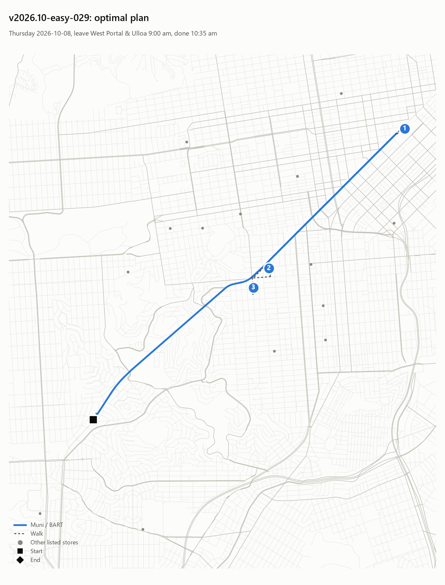
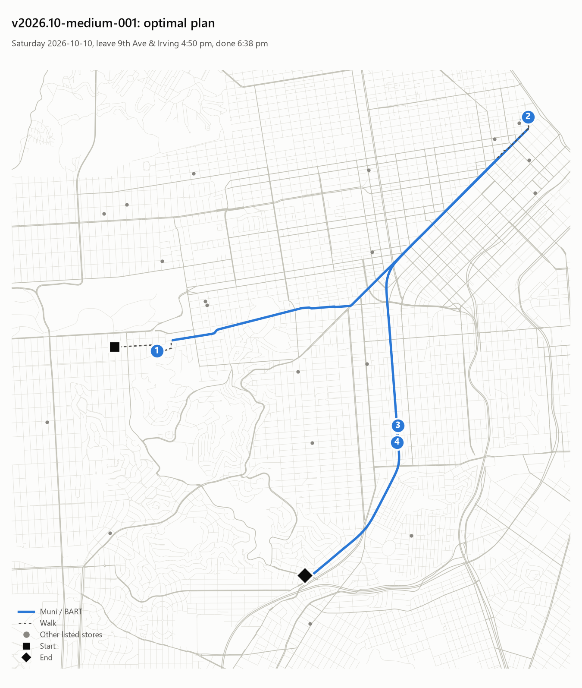
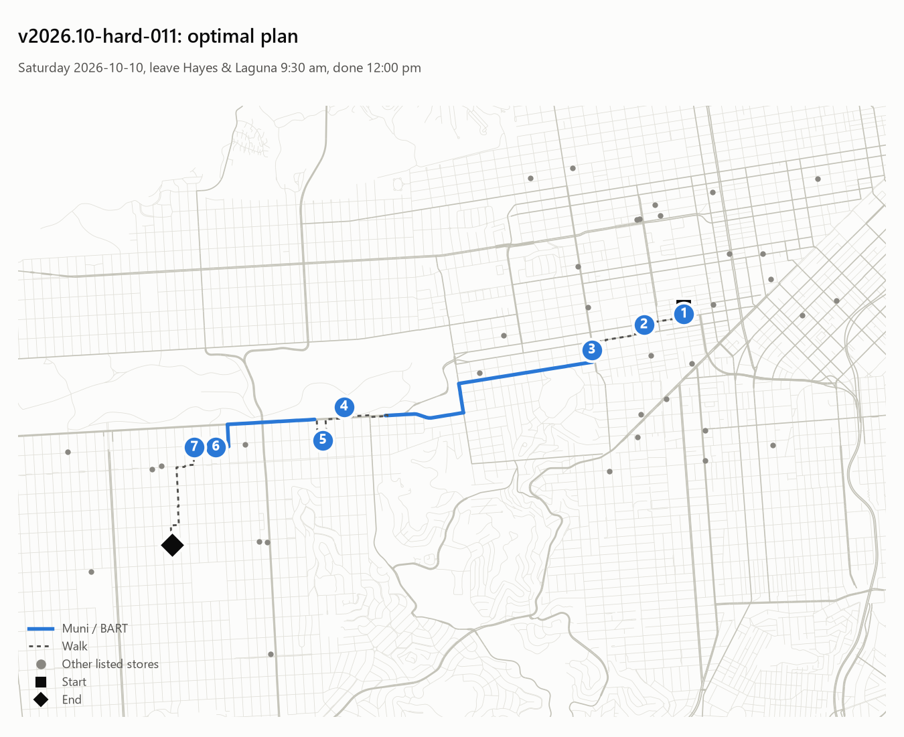

# Checkpoint 2: example tasks

## Easy: v2026.10-easy-029

> It's Thursday, October 8, and I'm heading out from West Portal & Ulloa (West Portal) around 9:00 am. No car today: just Muni, BART and walking. Today I need to do a grocery run at a Trader Joe's (about 20 minutes), drop off library books at a library (about 10 minutes), and buy a birthday present at a bookstore (about 15 minutes). When I'm done I'm meeting a friend at 18th & Castro (Castro) and need to be there by 12:30 pm. Which specific stores should I go to, and in what order, so I'm done as early as possible? If it can't all be done, tell me it's impossible and why.

| # | Errand | Store | Arrive | Start | Done | Getting there |
|---|---|---|---|---|---|---|
| 1 | Supermarket | Trader Joe's | 9:24 am | 9:24 am | 9:44 am | Walk 3 → M OCEAN VIEW 13 → Walk 2 |
| 2 | Library | Eureka Valley / Harvey Milk Memorial Branch Library | 10:03 am | 10:03 am | 10:13 am | Walk 3 → M OCEAN VIEW 6 → Walk 5 |
| 3 | Bookstore | Fabulosa Books | 10:20 am | 10:20 am | 10:35 am | Walk 7 |
| → | End | 18th & Castro | 10:35 am | | | Walk 0 |

Optimal finish **10:35 am** (95 min) over the listed stores; over every store in SF: 10:35 am (95 min).

## Medium: v2026.10-medium-001

> Help me plan errands on Saturday, October 10. I start at 9th Ave & Irving (Sunset) at 4:50 pm. No car today: just Muni, BART and walking. Today I need to mail a package at a post office (about 15 minutes), buy flowers at a florist (about 10 minutes), withdraw cash at a bank or ATM (about 5 minutes), and drop off library books at a library (about 10 minutes). When I'm done I'm meeting a friend at Diamond & Bosworth (Glen Park) and need to be there by 7:35 pm. Tell me exactly which stores to visit and in what order so I finish as early as I can. If it can't all be done, tell me it's impossible and why.

| # | Errand | Store | Arrive | Start | Done | Getting there |
|---|---|---|---|---|---|---|
| 1 | Library | Kalmanovitz Library | 5:00 pm | 5:00 pm | 5:10 pm | Walk 10 |
| 2 | Post office | FedEx Office | 5:38 pm | 5:38 pm | 5:53 pm | Walk 5 → N JUDAH 19 → Walk 1 → 12 FOLSOM-PACIFIC 1 → Walk 2 |
| 3 | Bank / ATM | Bank of America ATM | 6:11 pm | 6:11 pm | 6:16 pm | Walk 11 → BART Green-S 8 → Walk 1 |
| 4 | Florist | La Poblanita | 6:19 pm | 6:19 pm | 6:29 pm | Walk 4 |
| → | End | Diamond & Bosworth | 6:38 pm | | | Walk 2 → BART Red-S 3 → Walk 1 |

Optimal finish **6:38 pm** (108 min) over the listed stores; over every store in SF: 6:33 pm (103 min).

## Hard: v2026.10-hard-011

> It's Saturday, October 10, and I'm heading out from Hayes & Laguna (Hayes Valley) around 9:30 am. No car today: just Muni, BART and walking. Today I need to buy a new inner tube at a bike shop (about 20 minutes), drop off library books at a library (about 10 minutes), drop off a suit at a dry cleaner (about 5 minutes), withdraw cash at a bank or ATM (about 5 minutes), buy flowers at a florist (about 10 minutes), pick up a book I ordered at a bookstore (about 15 minutes), and buy pastries at a bakery (about 5 minutes). I have to withdraw cash at a bank or ATM by 11:45 am at the latest. When I'm done I'm meeting a friend at 30th Ave & Noriega (Sunset) and need to be there by 12:10 pm. Which specific stores should I go to, and in what order, so I'm done as early as possible? If it can't all be done, tell me it's impossible and why.

| # | Errand | Store | Arrive | Start | Done | Getting there |
|---|---|---|---|---|---|---|
| 1 | Bakery | hahdough | 9:31 am | 9:31 am | 9:36 am | Walk 1 |
| 2 | Dry cleaning | Majesty Cleaner | 9:42 am | 9:42 am | 9:47 am | Walk 6 |
| 3 | Bookstore | Comix Experience | 9:57 am (waits 3 min) | 10:00 am | 10:15 am | Walk 10 |
| 4 | Library | Helen Crocker Russell Horticultural Library | 10:36 am | 10:36 am | 10:46 am | Walk 2 → 7 HAIGHT-NORIEGA 10 → Walk 8 |
| 5 | Florist | French Florist | 10:54 am | 10:54 am | 11:04 am | Walk 9 |
| 6 | Bank / ATM | Chase | 11:17 am | 11:17 am | 11:22 am | Walk 4 → 7 HAIGHT-NORIEGA 4 → Walk 2 |
| 7 | Bike shop | Barbary Coast Cyclery | 11:25 am | 11:25 am | 11:45 am | Walk 3 |
| → | End | 30th Ave & Noriega | 12:00 pm | | | Walk 17 |

Optimal finish **12:00 pm** (150 min) over the listed stores; over every store in SF: 11:48 am (138 min).

